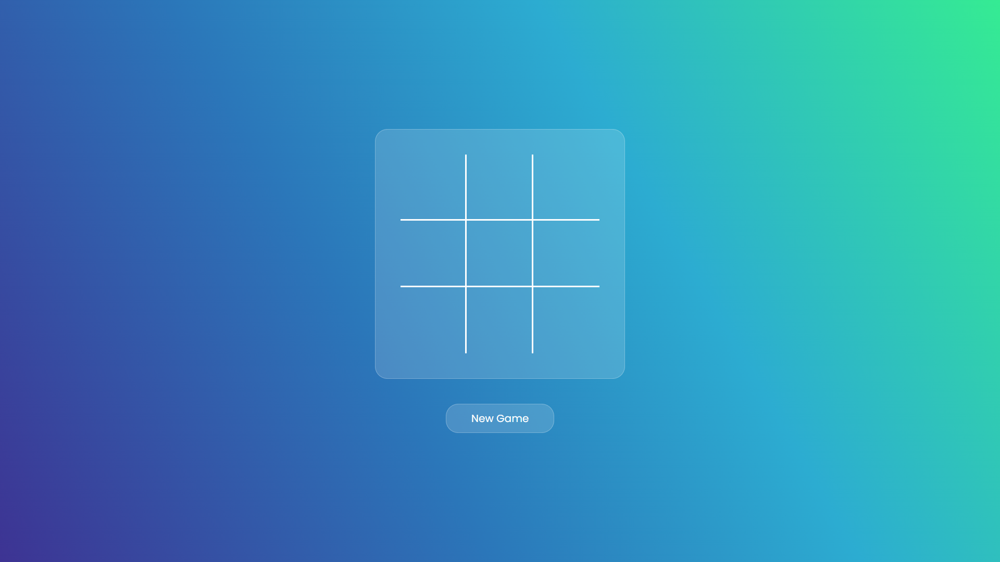
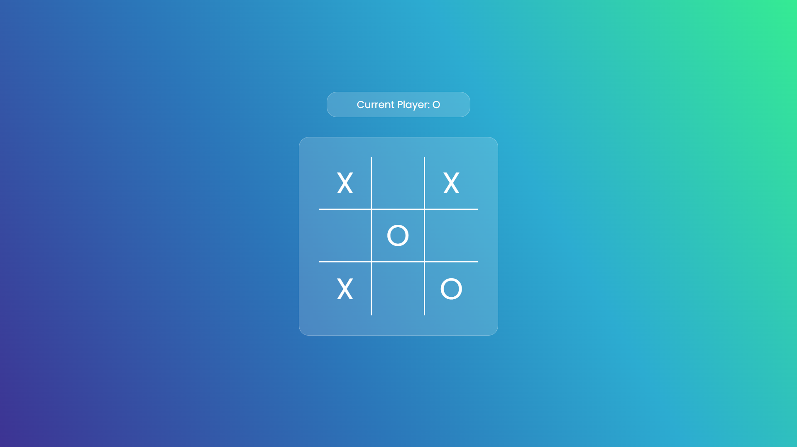
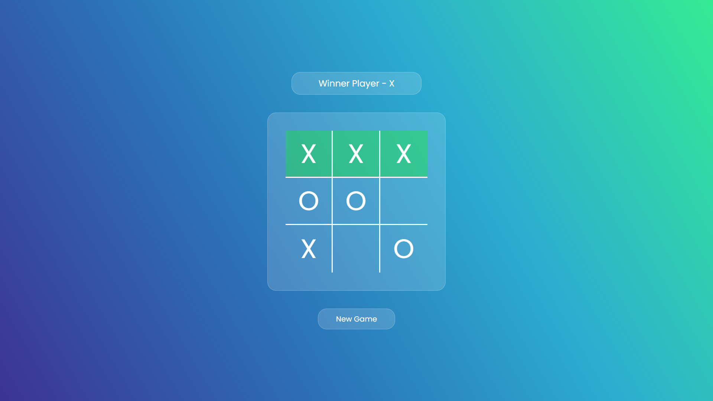
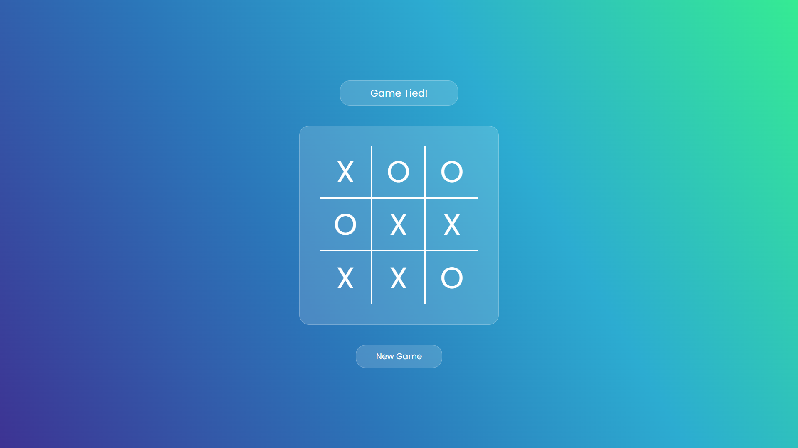

# Tic Tac Toe

## Overview

**Tic Tac Toe** is a classic game of Xs and Os, implemented using HTML, CSS, and JavaScript. This interactive version includes modern features such as real-time game status updates, audio effects for various game events, and responsive design to ensure a great experience on different devices.

## Table of Contents

- [Overview](#overview)
- [Project Link](#project-link)
- [Features](#features)
- [How to Play](#how-to-play)
- [Screenshots](#screenshots)
- [Installation](#installation)
- [Technologies Used](#technologies-used)
- [Contributing](#contributing)
- [Contact](#contact)

## Project Link

```bash
  https://official-tushar.github.io/TIc-Tac-Toe/
```

## Features

- **Responsive Design**: Adapts to various screen sizes for optimal play on both mobile and desktop devices.
- **Player Interaction**: Players can easily make their moves by clicking on the grid cells.
- **Game Notifications**: Displays real-time updates about the current player and game status.
- **Audio Effects**: Includes sounds for game start, player moves, game wins, and draws.
- **New Game Button**: Easily restart the game once it ends.

## How to Play

1. **Start a Game**: Click the "New Game" button to begin a new game.
2. **Make Moves**: Click on any empty cell to place your marker ("X" or "O").
3. **Win or Draw**: The game automatically detects winning combinations or a draw and displays a message. Relevant audio effects are played for these events.

## Screenshots


*Game start screen.*


*Player O's turn to make a move.*


*Player X wins the game.*


*The game ends in a draw.*

## Installation

To run this game locally, follow these steps:

1. **Clone the Repository**:
   ```bash
   https://github.com/official-Tushar/TIc-Tac-Toe.git

2. **Navigate to the Project Directory**:
   ```bash
   cd tic-tac-toe

1. **Open index.html**:
   Open the index.html file in your preferred web browser to start playing.

## Technologies Used


- **HTML**: For the structure of the game.
- **CSS**: For styling and responsive design.
- **JavaScript**: For game logic and interactivity.

## Contributing


Contributions are welcome! If you have suggestions for improvements or new features, feel free to open an issue or submit a pull request.

## Contact

If you have any questions or feedback, feel free to reach out:

- Email: tusharsrivastava8404@gmail.com
- GitHub: [official-Tushar](https://github.com/official-Tushar)

---

Thank you for checking out my Tic tac toe game project! I hope you will like it.
